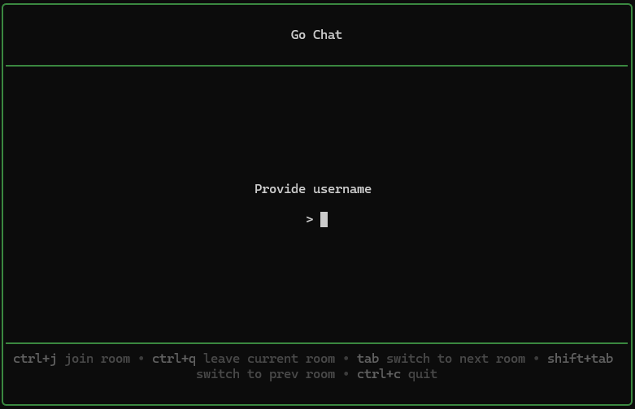
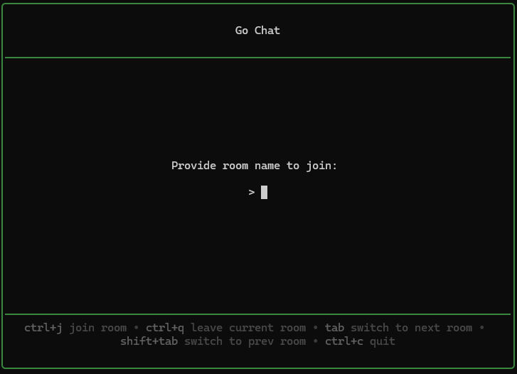
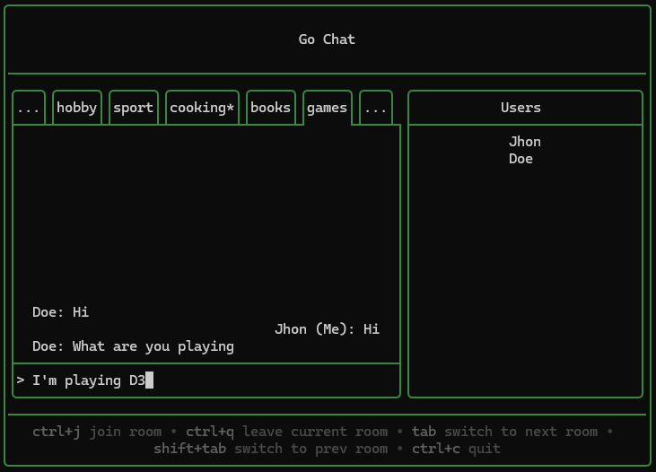

# Chat Client
A chat client built in Go, designed to seamlessly connect with the corresponding chat server. Powered by Bubbletea, it features a modern, scalable, and user-friendly Text User Interface (TUI) for effortless interaction.

## Key Features

- Establishes real-time user sessions with the chat server using WebSocket. Note: Reconnection is not supported in the current version.
- Allows users to set usernames, join or create rooms, and send messages with ease.
- Offers a clean and responsive TUI, ensuring a smooth experience across different screen sizes.

### Screenshots
#### Setting a Username
Easily set your unique username to start chatting.

#### Joining a Room
Quickly join or create chat rooms to connect with others.

#### Sending Messages
Engage in real-time conversations with a streamlined messaging interface.

